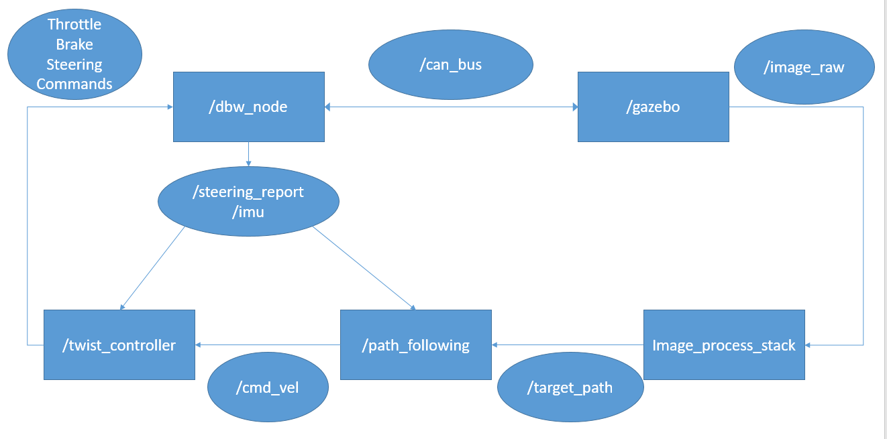

#Final Design Repo

## 1. Introduction
This is the core codes for my final year project in ZJU, and is a personal practice to learn about self-driving car simulation and algorithms.

The main topic of the final year project is robust control of autonomous vehicles. The main contributions include $\mu$-synthesis twist controller and an adaptive non-linear model predictive controller for tracking. 

Some matlab codes are included demonstrating the process of exploring and work with the design of the robust controller.

The main demonstration part makes use of the semi-open source project Dataspeed ADAS Development Vehicle Kit. More basic information and guides to setup the environments can be found in the [official sites](https://bitbucket.org/DataspeedInc/dbw_mkz_ros) and their [official documents](https://bitbucket.org/DataspeedInc/dbw_mkz_ros/src/4f3e09f7c23e6cb3672092d3c194569a109d884d/ROS_SETUP.md?fileviewer=file-view-default).

However, there is limited guides to make the platform work for us. Firstly, it takes some time to understand the structure of the system from rqt_graph or source code directly, especially for a beginner like me. Besides, as observed in the source code [site](https://bitbucket.org/DataspeedInc/dbw_mkz_ros/src) (2018.11.23), the source code of the package "dbw_mkz_vision_sim" is not available yet.

This project starts from the most sophisticated demo provided officially from Dataspeed, i.e. "lane_keep_demo.launch" where a car is controlled to keep in lane.

The basic structure of the demo launch file can be summarized by the following picture.

The /gazebo node is the simulation platform and communicate with the other softwares through CAN bus topics and image topics(/vehicle/image_raw). The /dbw_node node is an officially provided node that output sensor messages and receive control messages. We got to customized our own image_processing, path_following and controller codes.

Notice:

Due to the change of the officially provided source code after version 1.1.0 , the struture of the officially supported nodes have changed. The structure of the repo still works (12/23/2018), but may be depreciated further in the future. The original version I was using can be found in [https://bitbucket.org/DataspeedInc/dbw_mkz_ros/downloads/ADAS_Kit_FORD_20181026.zip](https://bitbucket.org/DataspeedInc/dbw_mkz_ros/downloads/ADAS_Kit_FORD_20181026.zip).

## 2. Dependencies
The path_following node is actually implemented similar to the Udacity [MPC project](https://github.com/udacity/CarND-MPC-Project) in self-driving car Nanodegree program. 

More importantly, install ipopt library. Personally I recommend following guides also from [udacity](https://github.com/udacity/CarND-MPC-Project/blob/master/install_Ipopt_CppAD.md). 

The lane detector node relies on opencv as well as CV_bridge. They can be installed along with ROS itself.

## 3. User Manual

The entire project is part of a workspace, merge the packages inside the src folder of a ROS workspace, run catkin_make.

### (1). Launch Files

Currently the launch files look a little bit messy, but simply launch final_design -> omega_control.launch is OK and many parameters can be tunned here.
### (2). Customed Nodes

#### a. /vehicle/twist_controller

There exists two path_followers in my_launch_car_sim and final_design. The my_launch_car_sim implements basic PID while the final_design one implements $\mu$-synthesis controller for lateral control.

<b>Subscribing to</b>:

/vehicle/steering_report:[dbw_mkz_msgs/SteeringReport](https://bitbucket.org/DataspeedInc/dbw_mkz_ros/src/4f3e09f7c23e6cb3672092d3c194569a109d884d/dbw_mkz_msgs/msg/SteeringReport.msg?at=default&fileviewer=file-view-default)

    Just the speed information of the car will be retrieved for simplicity.

/vehicle/imu/data_raw:[sensor_msgs/Imu](http://docs.ros.org/api/sensor_msgs/html/msg/Imu.html)

    Only the angular velocity will be used for feedback control. Similar to the official codes.

/vehicle/cmd_vel:[geometry_msgs/Twist](http://docs.ros.org/api/geometry_msgs/html/msg/Twist.html)

    Command from path_following_node, containing linear speed and angular velocity.

<b>Publishing to</b>:

/vehicle/throttle_cmd:[dbw_mkz_msgs/ThrottleCmd](https://bitbucket.org/DataspeedInc/dbw_mkz_ros/src/4f3e09f7c23e6cb3672092d3c194569a109d884d/dbw_mkz_msgs/msg/ThrottleCmd.msg?at=default&fileviewer=file-view-default)

/vehicle/steering_cmd:[dbw_mkz_msgs/SteeringCmd](https://bitbucket.org/DataspeedInc/dbw_mkz_ros/src/4f3e09f7c23e6cb3672092d3c194569a109d884d/dbw_mkz_msgs/msg/SteeringCmd.msg?at=default&fileviewer=file-view-default)

/vehicle/brake_cmd:[dbw_mkz_msgs/BrakeCmd](https://bitbucket.org/DataspeedInc/dbw_mkz_ros/src/4f3e09f7c23e6cb3672092d3c194569a109d884d/dbw_mkz_msgs/msg/BrakeCmd.msg?at=default&fileviewer=file-view-default)

#### b. /vehicle/path_follower

There exists two path_followers in my_launch_car_sim and final_design. The my_launch_car_sim implements normal nonlinear MPC while the final_design one implements the adaptive nonlinear MPC.

<b>Subscribing to</b>:

/vehicle/steering_report:[dbw_mkz_msgs/SteeringReport](https://bitbucket.org/DataspeedInc/dbw_mkz_ros/src/4f3e09f7c23e6cb3672092d3c194569a109d884d/dbw_mkz_msgs/msg/SteeringReport.msg?at=default&fileviewer=file-view-default)

/vehicle/target_path:[nav_msgs/Path](http://docs.ros.org/api/nav_msgs/html/msg/Path.html)

    Target path provided by the vision system. Though the frame_id is not explicitly written in the msgs themselves, the frame_id should be "/vehicle/base_footprint" almost the center of the car.

<b>Publishing to</b>:

/vehicle/cmd_vel:[geometry_msgs/Twist](http://docs.ros.org/api/geometry_msgs/html/msg/Twist.html)

    Twist command provided to twist controller.

#### c. /vehicle/lane_detector
my_launch_car_sim/src/lane_detector_node.cpp implements a single-threaded lane-detector that deal with the image and output target_path.

my_launch_car_sim/scipts/get_test_image_info.py helps retrieve images for testing the image_pipeline. Pictures stored in ./scripts/pictures

my_launch_car_sim/src/lane_detector_tester.cpp implements a simple testing file that helps adjusting image-processing parameters (For development use).

Working pipeline at each time step of image Callback:

1. Image preprocessing from imageProcessor.hpp. Get ROI and masks for yellow and white points repectively.
2. Transform points in the picture to points in the vehicle coordinates. Notice the placement of the camera can be obtained from observing messages published from tf and is hard coded in laneDetectorNode.hpp.
3. The roadTracker implement RANSAC to fit a second order polynomial to the white and yellow points. Notice we only consider yellow points on the right of the white lane here (this is quite a dirty trick here).
4. The target road is simply the weighted sum of two detected roads.

<b>Subscribing to</b>:

/vehicle/front_camera/image_raw:[sensor_msgs/Image](http://docs.ros.org/melodic/api/sensor_msgs/html/msg/Image.html)

<b>Publishing to</b>:

/vehicle/target_path:[nav_msgs/Path](http://docs.ros.org/api/nav_msgs/html/msg/Path.html)